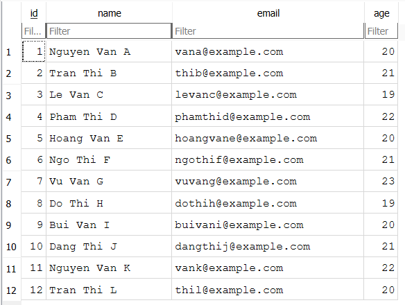
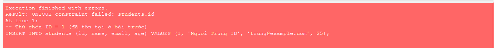
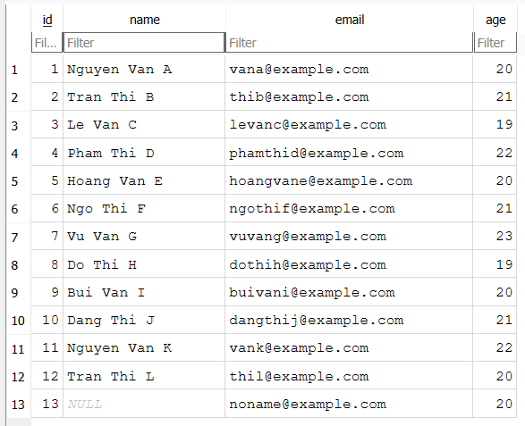
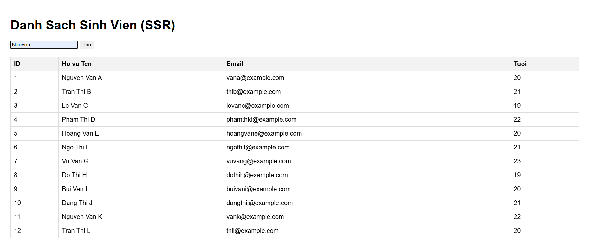
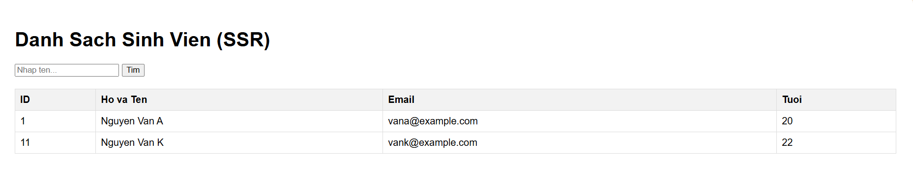

## CÔNG NGHỆ PHẦN MỀM NÂNG CAO
## LAB SERIES: XÂY DỰNG WEB APP CĂN BẢN

**Thành viên:**
- Nguyễn Ngọc Châu Phúc - 2212631
- Nguyễn Nhật Khoa - 2211629

---

## MỤC LỤC
1. [Hướng dẫn cách chạy dự án](#1-hướng-dẫn-cách-chạy-dự-án)
2. [Public URL](#2-public-url)
3. [Trả lời các câu hỏi](#3-trả-lời-các-câu-hỏi)
   - [Lab 1](#lab-1)
     - [1.1. Thao tác với dữ liệu lớn](#11-thao-tác-với-dữ-liệu-lớn)
     - [1.2. Phân tích ràng buộc Khóa chính (Primary Key)](#12-phân-tích-ràng-buộc-khóa-chính-primary-key)
     - [1.3. Kiểm tra tính toàn vẹn dữ liệu (Constraints)](#13-kiểm-tra-tính-toàn-vẹn-dữ-liệu-constraints)
     - [1.4. Cơ chế vận hành của Hibernate](#14-cơ-chế-vận-hành-của-hibernate)
   - [Lab 2](#lab-2)
   - [Lab 3](#lab-3)
     - [3.1. Chức năng tìm kiếm](#31-chức-năng-tìm-kiếm)

---

## 1. Hướng dẫn cách chạy dự án

### Yêu cầu hệ thống
- **Java:** JDK 21 hoặc mới hơn.
- **Maven:** Phiên bản 3.8.x trở lên.

### Các bước thực hiện
1. **Tải mã nguồn:** Clone dự án từ repository hoặc tải về thư mục máy tính.
2. **Chạy ứng dụng:** Mở terminal tại thư mục `student-management` và chạy lệnh:
   ```powershell
   mvn spring-boot:run
   ```
3. **Truy cập giao diện:** Sau khi server khởi động thành công trên cổng 8080, mở trình duyệt và truy cập:
   `http://localhost:8080/students`

---

## 2. Public URL
*(Tạm thời chưa có)*

---

## 3. Trả lời các câu hỏi

### Lab 1
Dưới đây là kết quả thực hiện các yêu cầu mở rộng và phân tích các tình huống giả định trong bài Lab:

#### 1.1. Thao tác với dữ liệu lớn
- **Thực hiện:** Đã thêm thủ công 10 bản ghi sinh viên mới vào bảng `students` bằng câu lệnh `INSERT` trong DB Browser.

```sql
INSERT INTO students (id, name, email, age) VALUES (3, 'Le Van C', 'levanc@example.com', 19);
INSERT INTO students (id, name, email, age) VALUES (4, 'Pham Thi D', 'phamthid@example.com', 22);
INSERT INTO students (id, name, email, age) VALUES (5, 'Hoang Van E', 'hoangvane@example.com', 20);
INSERT INTO students (id, name, email, age) VALUES (6, 'Ngo Thi F', 'ngothif@example.com', 21);
INSERT INTO students (id, name, email, age) VALUES (7, 'Vu Van G', 'vuvang@example.com', 23);
INSERT INTO students (id, name, email, age) VALUES (8, 'Do Thi H', 'dothih@example.com', 19);
INSERT INTO students (id, name, email, age) VALUES (9, 'Bui Van I', 'buivani@example.com', 20);
INSERT INTO students (id, name, email, age) VALUES (10, 'Dang Thi J', 'dangthij@example.com', 21);
INSERT INTO students (id, name, email, age) VALUES (11, 'Nguyen Van K', 'vank@example.com', 22);
INSERT INTO students (id, name, email, age) VALUES (12, 'Tran Thi L', 'thil@example.com', 20);
```

- **Kết quả:** Database phản hồi nhanh chóng, tab *Browse Data* hiển thị đầy đủ danh sách sinh viên, xác nhận SQLite hoạt động ổn định với lượng dữ liệu nhỏ và vừa.

<p align="center">
  
</p>

#### 1.2. Phân tích ràng buộc Khóa chính (Primary Key)
- **Thử nghiệm:** Cố tình thực hiện lệnh `INSERT` một sinh viên mới có id trùng với id đã tồn tại trong bảng.

```sql
INSERT INTO students (id, name, email, age) VALUES (1, 'Nguoi Trung ID', 'trung@example.com', 25);
```

- **Kết quả:** Hệ thống trả về lỗi: `UNIQUE constraint failed`.

<p align="center">
  
</p>

- **Giải thích:** Database chặn thao tác này vì cột `id` đã được khai báo là `PRIMARY KEY`. Khóa chính có tính chất là duy nhất (Unique) để định danh cho mỗi hàng trong bảng. Nếu cho phép trùng ID, hệ thống sẽ không thể phân biệt được các bản ghi khác nhau, gây mất tính toàn vẹn dữ liệu. Thông báo `UNIQUE constraint failed` xác nhận rằng giá trị này đã tồn tại và không được phép ghi đè.

#### 1.3. Kiểm tra tính toàn vẹn dữ liệu (Constraints)
- **Thử nghiệm:** Insert một sinh viên mới nhưng để trống (`NULL`) ở cột `name`.

```sql
-- Thử chèn sinh viên có tên bị NULL
INSERT INTO students (id, name, email, age) VALUES (13, NULL, 'noname@example.com', 20);
```

- **Kết quả:** Database SQLite mặc định sẽ không báo lỗi vì lúc tạo bảng ta chưa thêm ràng buộc `NOT NULL` cho cột `name`.

<p align="center">
  
</p>

- **Rủi ro khi code Java:** Khi Java sử dụng Hibernate để map dữ liệu này lên biến `String name` trong Entity, biến đó sẽ nhận giá trị null. Nếu code Java không kiểm tra (check null) mà thực hiện các thao tác như `name.toUpperCase()` hoặc hiển thị lên giao diện, ứng dụng sẽ bị lỗi `NullPointerException` (Lỗi tham chiếu null), gây crash hoặc lỗi logic hiển thị.

#### 1.4. Cơ chế vận hành của Hibernate
- **Hiện tượng:** Mỗi lần khởi động lại ứng dụng, toàn bộ dữ liệu cũ trong Database đều bị xóa sạch.
- **Giải thích:** Do cấu hình `spring.jpa.hibernate.ddl-auto=create` trong file `application.yaml`.

```yaml
jpa:
  database-platform: org.hibernate.community.dialect.SQLiteDialect
  hibernate:
    ddl-auto: create
  show-sql: true
```

- **Cơ chế:** Với chế độ `create`, Hibernate sẽ thực hiện lệnh `DROP` (xóa) bảng cũ và `CREATE` (tạo) lại bảng mới mỗi khi Application Context được khởi tạo. Để giữ lại dữ liệu cũ, ta nên đổi cấu hình này thành `update` (chỉ cập nhật thay đổi cấu trúc) hoặc `none` (không làm gì cả).

---

### Lab 2
*(Nội dung đang cập nhật)*

---

### Lab 3

#### 3.1. Chức năng tìm kiếm
Triển khai chức năng tìm kiếm sinh viên theo tên thông qua giao diện người dùng.

<p align="center">
  
</p>

<p align="center">
  
</p>
