## CÔNG NGHỆ PHẦN MỀM NÂNG CAO
## LAB SERIES: XÂY DỰNG WEB APP CĂN BẢN

**Thành viên:**
- Nguyễn Ngọc Châu Phúc - 2212631
- Nguyễn Nhật Khoa - 2211629

---

## MỤC LỤC
1. [Giới thiệu dự án](#1-giới-thiệu-dự-án)
2. [Lộ trình thực hiện](#2-lộ-trình-thực-hiện)
3. [Công cụ & Công nghệ](#3-công-cụ--công-nghệ)
4. [Hướng dẫn chạy dự án](#4-hướng-dẫn-chạy-dự-án)
5. [Public URL](#5-public-url)
6. [Trả lời câu hỏi & Kết quả các bài Lab](#6-trả-lời-câu-hỏi--kết-quả-các-bài-lab)
   - [Lab 1: Khởi tạo & Kiến trúc](#lab-1-khởi-tạo--kiến-trúc)
   - [Lab 2: Backend REST API](#lab-2-backend-rest-api)
   - [Lab 3: Frontend (SSR)](#lab-3-frontend-ssr)
   - [Lab 4: Hoàn thiện sản phẩm (CRUD)](#lab-4-hoàn-thiện-sản-phẩm-crud)
   - [Lab 5: Docker & Cloud Deployment](#lab-5-docker--cloud-deployment)

---

## 1. Giới thiệu dự án
Dự án **Student Management** là một hệ thống quản lý hồ sơ sinh viên căn bản, được xây dựng để phục vụ cho buổi thực hành Scrum Agile. 
- **Bối cảnh:** Đóng vai trò là lõi xử lý dữ liệu (Core Service) cho một ứng dụng quản lý trường học.
- **Dịch vụ chính:** Quản lý thông tin (Tên, Email, Tuổi), cung cấp API cho các nền tảng khác, và lưu trữ dữ liệu bền vững.

---

## 2. Lộ trình thực hiện
Hệ thống được phát triển qua 5 giai đoạn:
1. **Lab 1:** Khởi tạo project Spring Boot và cấu hình database SQLite.
2. **Lab 2:** Xây dựng lõi Backend (Entity, Repository, Service) và REST API.
3. **Lab 3:** Xây dựng giao diện Web Server-Side Rendering (SSR) với Thymeleaf.
4. **Lab 4:** Hoàn thiện đầy đủ tính năng CRUD UI và chuyển đổi sang PostgreSQL.
5. **Lab 5:** Đóng gói ứng dụng với Docker và triển khai lên Cloud (Render).

---

## 3. Công cụ & Công nghệ
- **Ngôn ngữ:** Java 21+
- **Framework:** Spring Boot 4.0.3 (Spring Data JPA, Spring Web, Thymeleaf).
- **Quản lý build:** Maven.
- **Database:** SQLite (Giai đoạn đầu), PostgreSQL @ Render (Giai đoạn cuối).
- **DevOps:** Docker, Docker Compose, Render.com.

---

## 4. Hướng dẫn chạy dự án

### Cách 1: Chạy trực tiếp (Maven)
```powershell
mvn spring-boot:run
```
Truy cập: `http://localhost:8080/students`

### Cách 2: Chạy với Docker Compose
```powershell
docker-compose up --build
```

---

## 5. Public URL
- **Link dự án:** [https://ase-lab.onrender.com/students](https://ase-lab.onrender.com/students)

---

## 6. Trả lời câu hỏi & Phân tích các Lab

### Lab 1: Khởi tạo & Kiến trúc
Dưới đây là kết quả thực hiện các yêu cầu mở rộng và phân tích các tình huống giả định trong bài Lab:

#### 1.1. Thao tác với dữ liệu lớn
- **Thực hiện:** Đã thêm thủ công 10 bản ghi sinh viên mới vào bảng `students` bằng câu lệnh `INSERT` trong DB Browser.

```sql
INSERT INTO students (id, name, email, age) VALUES (3, 'Le Van C', 'levanc@example.com', 19);
INSERT INTO students (id, name, email, age) VALUES (4, 'Pham Thi D', 'phamthid@example.com', 22);
INSERT INTO students (id, name, email, age) VALUES (5, 'Hoang Van E', 'hoangvane@example.com', 20);
INSERT INTO students (id, name, email, age) VALUES (6, 'Ngo Thi F', 'ngothif@example.com', 21);
INSERT INTO students (id, name, email, age) VALUES (7, 'Vu Van G', 'vuvang@example.com', 23);
INSERT INTO students (id, name, email, age) VALUES (8, 'Do Thi H', 'dothih@example.com', 19);
INSERT INTO students (id, name, email, age) VALUES (9, 'Bui Van I', 'buivani@example.com', 20);
INSERT INTO students (id, name, email, age) VALUES (10, 'Dang Thi J', 'dangthij@example.com', 21);
INSERT INTO students (id, name, email, age) VALUES (11, 'Nguyen Van K', 'vank@example.com', 22);
INSERT INTO students (id, name, email, age) VALUES (12, 'Tran Thi L', 'thil@example.com', 20);
```

- **Kết quả:** Database phản hồi nhanh chóng, tab *Browse Data* hiển thị đầy đủ danh sách sinh viên, xác nhận SQLite hoạt động ổn định với lượng dữ liệu nhỏ và vừa.

<p align="center">
  
</p>

#### 1.2. Phân tích ràng buộc Khóa chính (Primary Key)
- **Thử nghiệm:** Cố tình thực hiện lệnh `INSERT` một sinh viên mới có id trùng với id đã tồn tại trong bảng.

```sql
INSERT INTO students (id, name, email, age) VALUES (1, 'Nguoi Trung ID', 'trung@example.com', 25);
```

- **Kết quả:** Hệ thống trả về lỗi: `UNIQUE constraint failed`.

<p align="center">
  
</p>

- **Giải thích:** Database chặn thao tác này vì cột `id` đã được khai báo là `PRIMARY KEY`. Khóa chính có tính chất là duy nhất (Unique) để định danh cho mỗi hàng trong bảng. Nếu cho phép trùng ID, hệ thống sẽ không thể phân biệt được các bản ghi khác nhau, gây mất tính toàn vẹn dữ liệu. Thông báo `UNIQUE constraint failed` xác nhận rằng giá trị này đã tồn tại và không được phép ghi đè.

#### 1.3. Kiểm tra tính toàn vẹn dữ liệu (Constraints)
- **Thử nghiệm:** Insert một sinh viên mới nhưng để trống (`NULL`) ở cột `name`.

```sql
-- Thử chèn sinh viên có tên bị NULL
INSERT INTO students (id, name, email, age) VALUES (13, NULL, 'noname@example.com', 20);
```

- **Kết quả:** Database SQLite mặc định sẽ không báo lỗi vì lúc tạo bảng ta chưa thêm ràng buộc `NOT NULL` cho cột `name`.

<p align="center">
  
</p>

- **Rủi ro khi code Java:** Khi Java sử dụng Hibernate để map dữ liệu này lên biến `String name` trong Entity, biến đó sẽ nhận giá trị null. Nếu code Java không kiểm tra (check null) mà thực hiện các thao tác như `name.toUpperCase()` hoặc hiển thị lên giao diện, ứng dụng sẽ bị lỗi `NullPointerException` (Lỗi tham chiếu null), gây crash hoặc lỗi logic hiển thị.

#### 1.4. Cơ chế vận hành của Hibernate
- **Hiện tượng:** Mỗi lần khởi động lại ứng dụng, toàn bộ dữ liệu cũ trong Database đều bị xóa sạch.
- **Giải thích:** Do cấu hình `spring.jpa.hibernate.ddl-auto=create` trong file `application.yaml`.

```yaml
jpa:
  database-platform: org.hibernate.community.dialect.SQLiteDialect
  hibernate:
    ddl-auto: create
  show-sql: true
```

- **Cơ chế:** Với chế độ `create`, Hibernate sẽ thực hiện lệnh `DROP` (xóa) bảng cũ và `CREATE` (tạo) lại bảng mới mỗi khi Application Context được khởi tạo. Để giữ lại dữ liệu cũ, ta nên đổi cấu hình này thành `update` (chỉ cập nhật thay đổi cấu trúc) hoặc `none` (không làm gì cả).

---

### Lab 2: Backend REST API
Xây dựng tập hợp các API theo chuẩn RESTful để quản lý sinh viên.

#### Kết quả thực thi API:
| Khởi động Server | Kết quả trả về (JSON) |
|:---:|:---:|
| 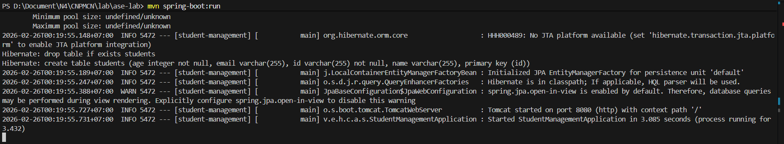 | 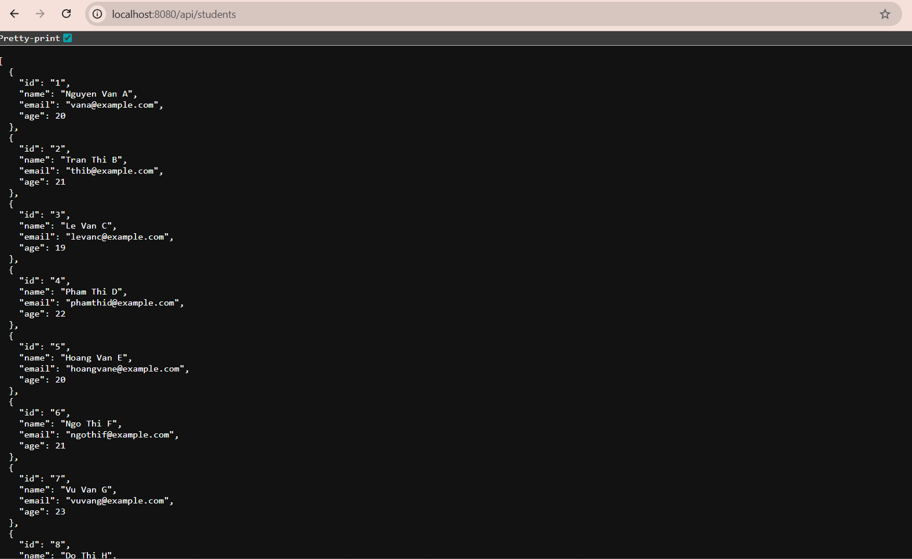 |

| Chi tiết sinh viên | Sinh viên không tồn tại |
|:---:|:---:|
| 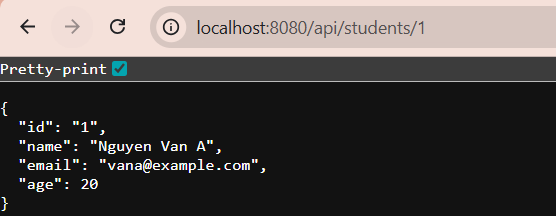 | 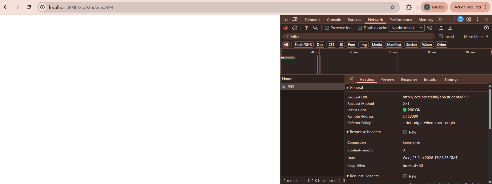 |

---

### Lab 3: Frontend (SSR)
#### 3.1. Chức năng tìm kiếm
Triển khai chức năng tìm kiếm sinh viên theo tên thông qua giao diện người dùng.

<p align="center">
  
</p>

<p align="center">
  
</p>

#### 3.2. Hiển thị có điều kiện
Sử dụng toán tử 3 ngôi trong Thymeleaf để áp dụng class CSS:
`th:class="${student.age < 18} ? 'text-danger' : ''"`

<p align="center">
  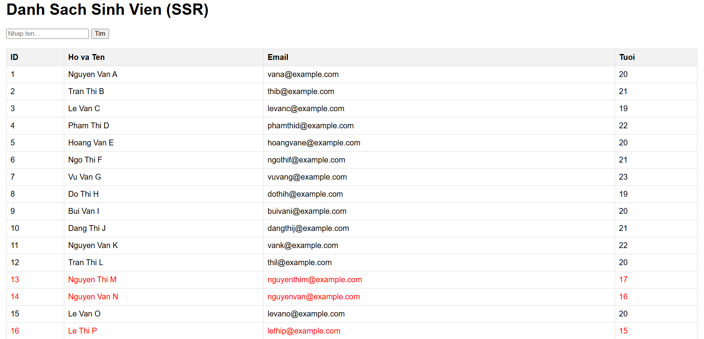
</p>

---

### Lab 4: Hoàn thiện sản phẩm (CRUD)
Chuyển đổi hoàn toàn sang giao diện quản lý đầy đủ.

#### Hình ảnh các module chức năng:
| Danh sách & Tìm kiếm | Chi tiết sinh viên |
|:---:|:---:|
| 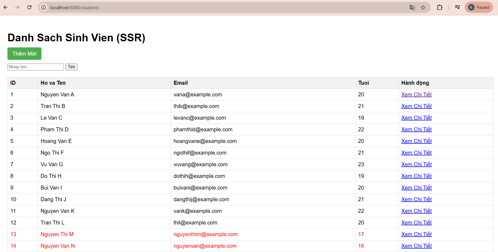 | 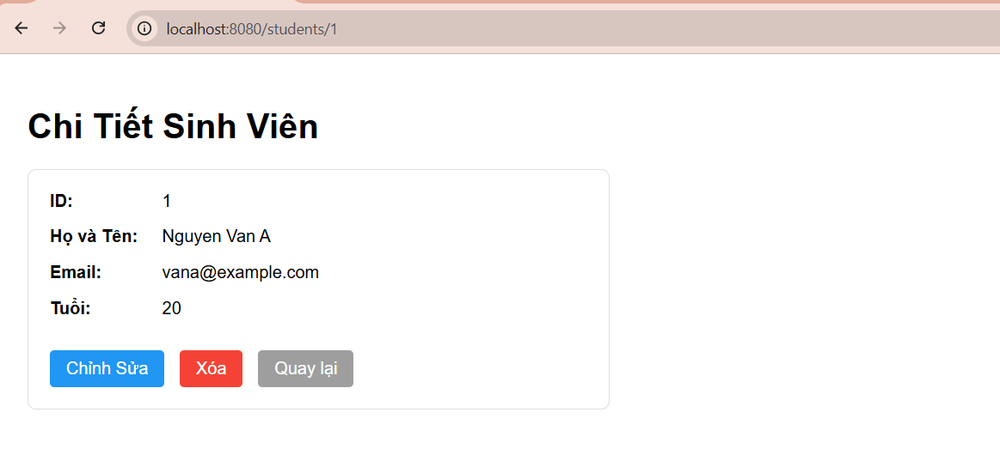 |

| Thêm mới | Kết quả Thêm mới |
|:---:|:---:|
| 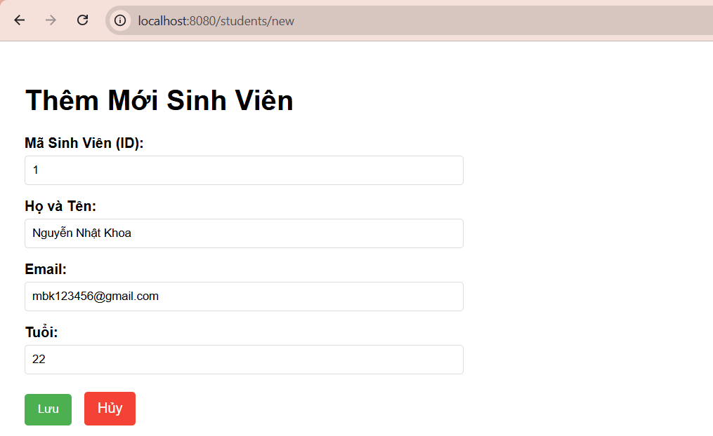 | 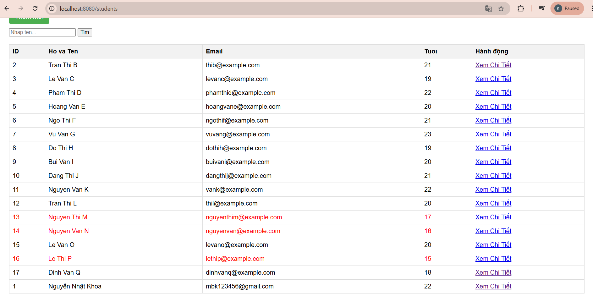 |

| Chỉnh sửa | Kết quả Chỉnh sửa | 
|:---:|:---:|
| 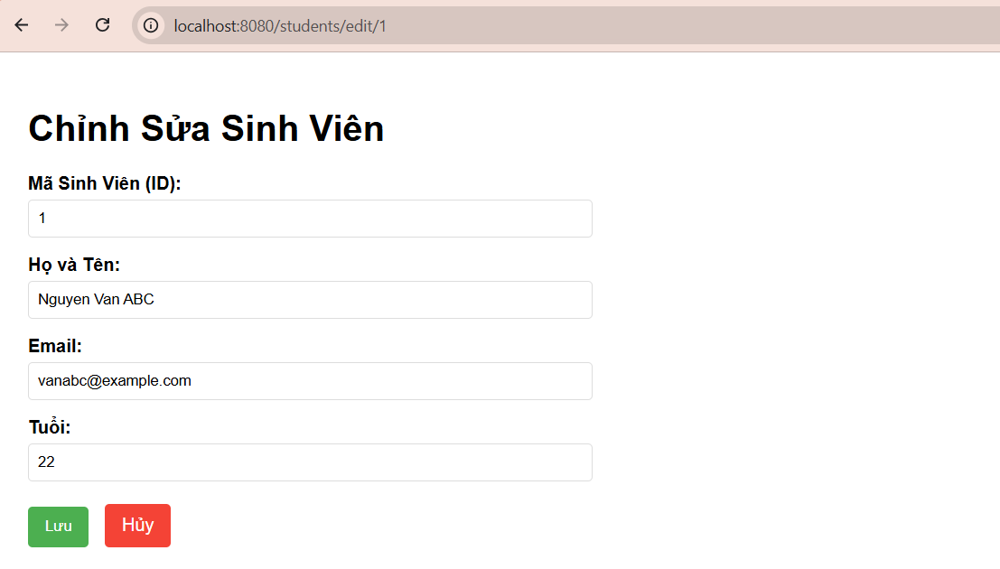 | 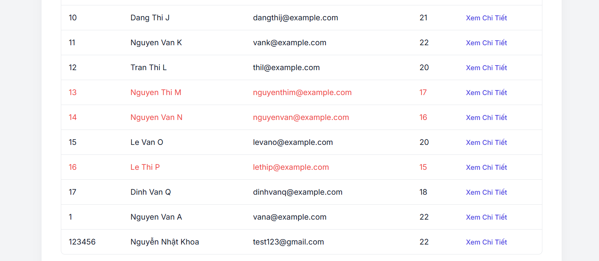 | 

| Thông báo xác nhận khi xóa | 
|:---:|
| 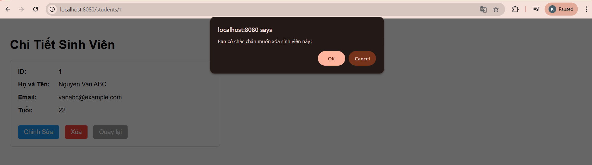 | 

---

### Lab 5: Docker & Cloud Deployment
#### 5.1. Lợi ích của Docker
Đóng gói mọi thư viện, runtime và cấu hình vào một đơn vị chuẩn hóa, đảm bảo ứng dụng chạy giống hệt nhau trên máy cá nhân và trên Server Render.

#### 5.2. Docker Multi-stage Build
Sử dụng 2 giai đoạn (Build & Run) trong Dockerfile giúp giảm kích thước Image cuối cùng, chỉ chứa file JAR thực thi mà không chứa toàn bộ mã nguồn hay Maven dependencies dư thừa.

#### 5.3. Một số lưu ý khi triển khai trên Render
- **Cold Start:** Do sử dụng gói **Free** của Render, ứng dụng sẽ tự động chuyển sang chế độ sleep sau 15 phút nếu không có bất kỳ lượt truy cập nào.
- **Thời gian chờ:** Lần truy cập đầu tiên sau khi ứng dụng ngủ thường mất từ 30 đến 60 giây hoặc có thể lâu hơn để khởi động lại toàn bộ hệ thống.
- **Tính ổn định:** Đây là giới hạn của gói miễn phí, giúp tiết kiệm tài nguyên nhưng vẫn đảm bảo trải nghiệm học tập và minh họa tốt.

